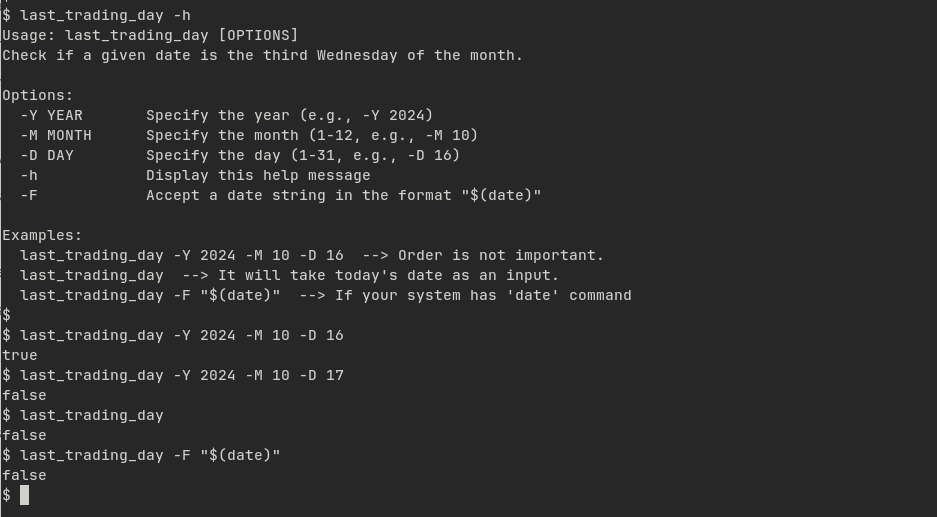
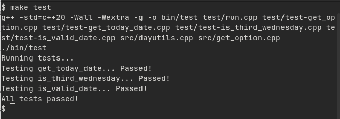

# The Last Trading Day

The `last_trading_day` program checks if a given date is the third Wednesday of the month. It accepts input from the command line and can also parse options for year, month, and day.



## Table of Contents

- [Usage](#usage)
- [Compilation](#compilation)
- [Testing](#testing)

## Usage

You can run the program with the following command:

```bash
./bin/last_trading_day [OPTIONS]
```

### Options

- `-Y YEAR`       Specify the year (e.g., `-Y 2024`)
- `-M MONTH`      Specify the month (1-12, e.g., `-M 10`)
- `-D DAY`        Specify the day (1-31, e.g., `-D 16`)
- `-h`            Display the help message
- `-F`            Accept a date string in the format `$(date)`

### Examples

1. To check if October 16, 2024, is the last trading day:
```bash
./bin/last_trading_day -Y 2024 -M 10 -D 16
```

2. To display the help message:
```bash
./bin/last_trading_day -h
```

3. To check if the current date is the last trading day:
```bash
./bin/last_trading_day
#or
./bin/last_trading_day -F "$(date)"
```

## Compilation

You can compile the program with the following command:

```bash
make
```

And you can remove the compiled files with:

```bash
make clean
```

If you want to install the program, you can run:

```bash
sudo make install
```

## Testing

You can run the tests with the following command:

```bash
make test
```




